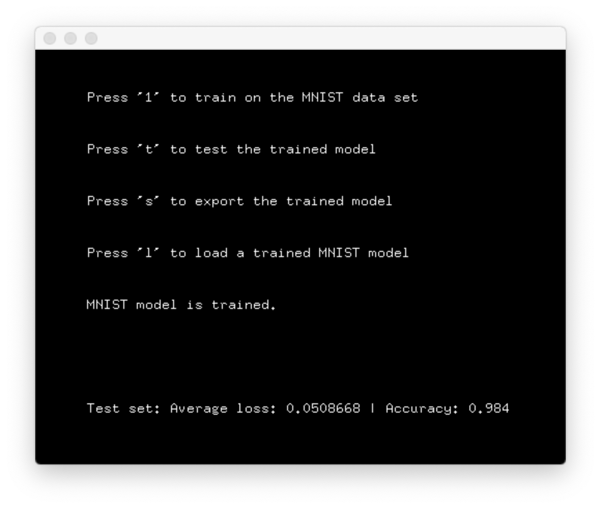

## testOfxLibTorch

This project is to verify basic functionality of the [ofxLibTorch](https://github.com/rystylee/ofxLibTorch) add-on.

## Requirements
- openframeworks v0.10
- libTorch v1.2.0
- ofxLibTorch
- ofxImGui
- opencv

## Setup
1. Run the openframeworks project generator to generate a xcode file.
2. Follow the instructions from the openframeworks [forum](https://forum.openframeworks.cc/t/i-want-to-run-libtorch-pytorch-c-frontend-in-openframeworks/32884/16) to adjust the build settings
3. Execute the download_mnist.py inside the bin/data/mnist folder
4. Enjoy

